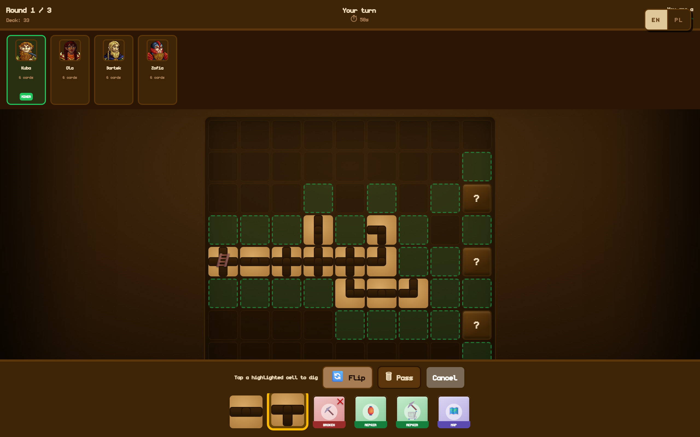
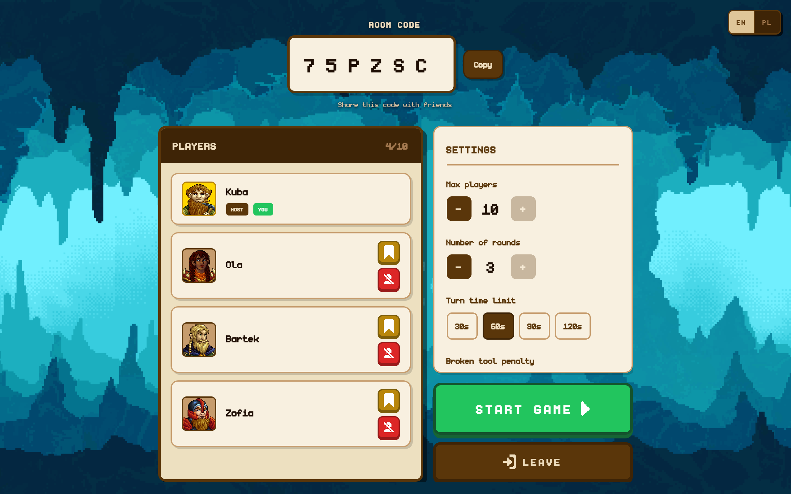
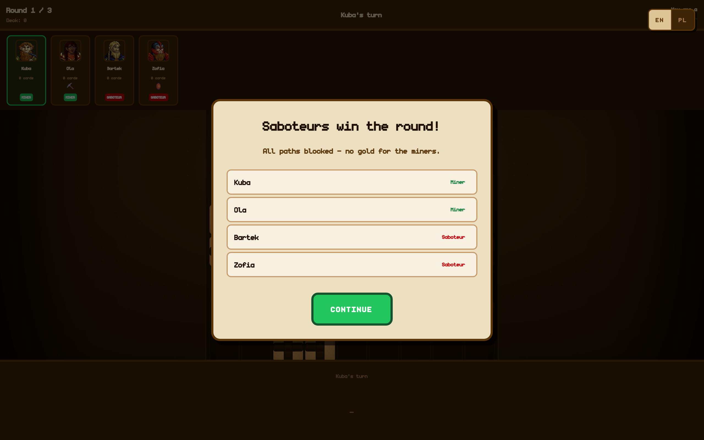
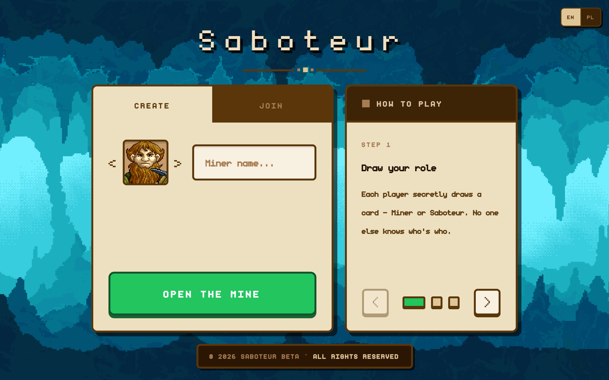

# Saboteur

_[English](README.md)_

Karcianka Saboteur do grania w przeglądarce. 3-10 osób, jeden kod pokoju, zero kont. Krasnoludy układają korytarze w stronę złota, a kilka z nich po cichu wolałoby, żeby nikt go nie znalazł.

Ogrywałem papierową wersję i szukałem pretekstu, żeby zrobić coś działającego w czasie rzeczywistym.

**Stack:** React 19 · Convex · Vite+ · Tailwind v4 · Framer Motion · Paraglide (en/pl)

## Zrzuty ekranu

Środek rundy, karta korytarza wzięta do ręki i podświetlone wszystkie pola, na które mogłaby pójść. Kopalnia musi dojść do jednej z trzech zakrytych kart po prawej, a złoto jest tylko pod jedną z nich.



Poczekalnia. Host ustawia limit graczy, liczbę rund i czas tury, reszta widzi zmiany na żywo.



Koniec rundy, czyli moment, w którym role idą na wierzch. Tym razem nikt się nie przekopał, więc kasę biorą dwaj sabotażyści.



<details>
<summary>Ekran startowy</summary>



</details>

Nagranie całej rundy leży w [docs/video/gameplay.webm](docs/video/gameplay.webm). Wszystko, razem ze zrzutami, robi `npm run shots`, które przeprowadza przez grę jedną prawdziwą przeglądarkę i trzy boty.

## Jak odpalić

```bash
vp install
npx convex dev    # pierwsze uruchomienie tworzy deployment i zapisuje .env.local
vp dev
```

Bez kluczy, bez danych startowych, bez rejestracji. Otwierasz dwie karty, w jednej zakładasz pokój, w drugiej wklejasz kod.

## Co znajduje się w aplikacji

- **Pokoje** - sześcioznakowy kod i losowe id sesji w localStorage, tyle wystarczy za tożsamość. Host może wyrzucać graczy i przekazać koronę; jak wyjdzie, ktoś ją dostanie automatycznie.
- **Zasady kładzenia kart** - BFS od karty startowej wylicza, dokąd da się dojść. Nowa karta musi pasować krawędziami _i_ dotykać przechodniej sieci, więc nie da się rozbudowywać ślepego zaułka. Najciekawsze są właśnie ślepe zaułki: mają wejścia, ale zablokowany środek, więc wyglądają na połączone i nie są.
- **Ukryte informacje** - publiczny stan gry, twoja ręka i twoja rola to trzy osobne zapytania. Klient nigdy nie dostaje niczego, czego nie powinien, więc w zakładce sieci nie ma czego szukać. Role odsłaniają się na koniec rundy, złoto na koniec gry.
- **Czas tury** - każda tura planuje timeout z numerem seryjnym. Zdążysz zagrać, numer się zmienia, timeout budzi się, widzi że jest nieaktualny i nic nie robi. Nie ma czego anulować.
- **Rozłączenia** - klient wysyła heartbeat co 10 s, a cron sprząta tych, po których cicho od 45. Puste pokoje kasują się same.
- **Rundy i złoto** - do trzech rund, bryłki z talii, która kurczy się przez całą grę, a wypłata sabotażystów zależy od tego, ilu ich było.
- **Dwa języki** - en/pl przez Paraglide, które kompiluje każdy komunikat do funkcji, więc nieużywane tłumaczenia wypadają przy buildzie zamiast lecieć do przeglądarki.

## Parę decyzji

**Zasady nie wiedzą o istnieniu Convexa.** `gameLogic.ts` i `gameData.ts` nie importują nic z backendu - sama geometria, osiągalność i liczby kart. Dzięki temu ciekawsza połowa gry testuje się zwykłym Vitestem, a mutacja dookoła to głównie zapis do bazy.

**Klient o niczym nie decyduje.** Każdy ruch idzie przez jedną mutację `playCard`, która odbudowuje planszę z bazy i waliduje od zera. Zielone pola na zrzucie to tylko uprzejmość aplikacji: podświetla każde puste sąsiednie pole, a nie każdy legalny ruch, i serwer dalej odrzuca wszystko, czego krawędzie się nie zgadzają.

**Każdy ruch kończy się tak samo.** `finalizeMove` dobiera kartę, przesuwa turę, sprawdza koniec rundy i planuje kolejny timer. Dodanie nowej karty akcji to napisanie, co ona robi, a nie przypominanie sobie sześciu rzeczy, które dzieją się potem.

## Testy

```bash
vp test
```

Geometria planszy i zasady kładzenia kart. Funkcje Convexa jeszcze nieobjęte.

## Status

Da się przejść od początku do końca. Grafiki są moje i placeholderowe, i widać to - to następna rzecz do zrobienia, razem z wrzuceniem tego gdzieś na produkcję.
